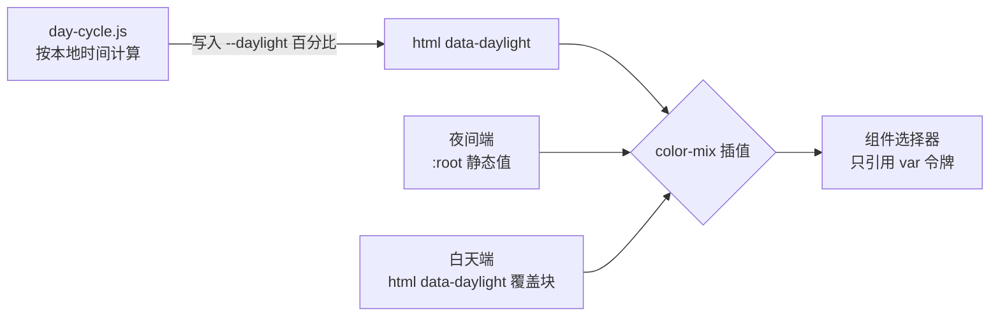

# PRD · 昼夜设计令牌化改造

## 背景

CREATEFUL 官网重设计的核心概念是「黄昏里的一块 HUD」。整站配色由 `--daylight`（0%=深夜 → 100%=正午）单一变量驱动，`day-cycle.js` 按访客本地时间实时写入。

改造前，各选择器里散布大量硬编码颜色与 `rgba()` 字面量，昼夜切换靠为每个组件重复写一套「白天版」规则，维护成本高且容易漏改。

## 目标

把所有随昼夜翻转的颜色收敛到设计令牌，选择器只引用令牌，不出现字面色值。

## 方案

### 双层令牌结构

1. **`:root` 块**存放夜间端基准值。无 JS、`data-daylight` 属性缺失时，整站停在这套值。
2. **`html[data-daylight]` 块**用 `color-mix(in oklab, 夜色, 昼色 var(--daylight))` 声明插值端。特异性相同、源码顺序靠后，故 JS 就绪时覆盖生效。
3. **`@property --daylight`** 注册为 `<percentage>`，浏览器才能对整站颜色做连续插值，避免分钟级跳变生硬。
4. 运行时令牌（`--sun-x` `--moon-y` `--w-day` 等）由 JS 注入，CSS 侧用 `var(--x, 兜底)` 保证 JS 未跑时不崩。

### 三重回退

| 场景 | 结果 |
|------|------|
| 浏览器不支持 `color-mix` | 覆盖块整条声明失效，停在夜间端 |
| 无 JS / JS 未加载 | `<html>` 无 `data-daylight`，覆盖块不匹配，停在夜间端 |
| `prefers-reduced-motion` | 关闭 `--daylight` 过渡，颜色仍跟随时间 |

### 有意不参与插值的令牌

- `--sky-night-*` / `--sky-day-*`：天空分层色，靠 `.sky--night/.sky--day` 的 `--w-night/--w-day` 权重叠加出黄昏，本身是固定调色锚点
- `--track-*`：时间条轨道是天空的抽象缩影，独立于 `--daylight`
- `--on-status` / `--*-tint` / `--*-ring`：状态色表面上的固定白字与半透明底，配对关系恒定
- 打印块 `#fff/#000`：纸张约束

## 验收标准

| ID | 可观察结果 | 验证方式 |
|----|-----------|---------|
| c1 | 组件选择器内不再有随昼夜翻转的硬编码色值 | `_audit.py`：剩余硬编码仅 1 行（打印块，注释说明） |
| c2 | 引用的令牌均有定义或有意为运行时注入 | `_audit.py`：11 个未定义令牌全部为 JS 运行时注入，CSS 侧有兜底 |
| c3 | CSS 语法完整，无未闭合括号 | `_check_css.py`：花括号净差 0，PASS |
| c4 | 浏览器实际渲染出插值后的颜色 | DevTools `getComputedStyle`：`--ink-0` 解析为 `color-mix(...)`，`body` 背景为 `oklab(...)` |
| c5 | 昼夜切换正常，无控制台报错 | DevTools：`.sky--day` opacity=1、`.sky--night` opacity=0；console 无 error/warn |
| c6 | 明暗交替节奏保留（纸白区白天反转成深色面） | `--paper` 白天端为 `#262b34`，与 `--ink-*` 白天转浅方向相反 |

## 非目标

- 不改动布局、交互、文案
- 不新增外部依赖（无 CDN / 无外部字体 / 无图标库）
- 不引入 JS 侧的颜色计算逻辑（插值全部交给 CSS `color-mix`）

## 交付物

- `css/main.css` — 令牌定义（`:root` 夜间端 + `html[data-daylight]` 插值端）、`@property` 注册、组件选择器引用
- `css/sections.css` — 分区组件样式，全部引用令牌
- `_audit.py` / `_check_css.py` — 自检脚本（临时工程文件，非站内资源）
